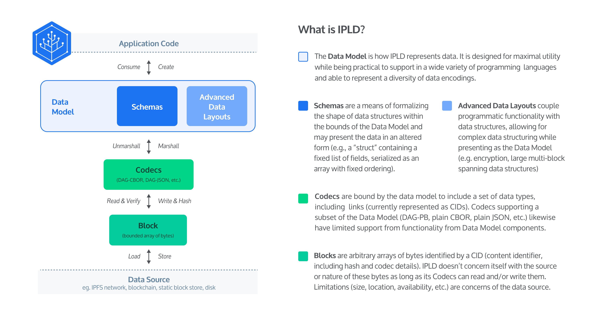

# IPFS v.s IPLD
- IPFS is a encoded collection of blobs of data.
- the CIDs associated with them.

## IPFS
- Only small files (within block size) are stored inside a single blob.
- Otherwise files are split into multiple blocks and linked in a graph.
- The root CID is linked to multiple other CIDs that link to de-dupped chumks of the data.

## IPLD
- You can link multiple addressing systems together.
- The CIDs "codec" can tell you how to decode the data when
its located and load its bytes. For example, JSON (0x0200).
- [More Details on Formats](https://multiformats.io)
- IPFS uses specific CODEC with IPLD, called DAG-PB (Protobuf), however
  we can abstract this, to move away from files to more generalized data-objects.
- Solves the problem of encoding JSON data into a file, when the JSON representation 
  itself can be worked on natively.

### IPLD Data Model
- Data Modle details forms the data takes in memory, from which the 
  codec transforms memory to encoded bytes.
- Includes: Booleans, Strings, Ints, Floats, Null, Arrays, Maps - Bytes & Links (CIDs)
- IPLD Block is like json but includes bytes and Links (not included in JSON)
- DAG-JSON
- DAG-CBOR - is the recommended system.
    - This can be decoded back to javascript data object. 
- We could use CID links to link back to a
## Merkle DAGs
    - A DAG with authenticated links down-stream through inclusion of recursive hashes.
    - Can have data throughout the data-structure.

## Questions
1. Could we store entire map data-structure on IPLD?
